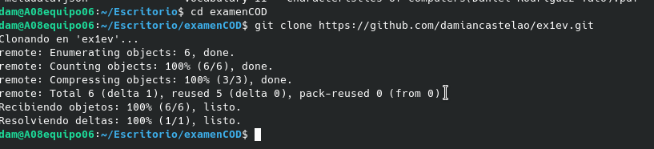
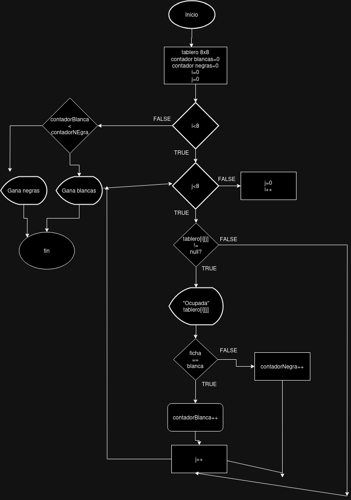

# Examen 1ª Evaluación

---

Explica a continación cada apartado del examen

Con cada apartado realiza un commit diferente

Clonar el repositorio

Diagrama de flujo

¿Cómo sería el tablero?
String[][] tablero = {
{"B", "N", "",  "", "", "", "", ""},  
{"",  "B",  "",  "", "", "", "", ""},  
{"",  "",  "",  "B", "N", "", "", ""},  
{"",  "",  "",  "", "", "", "", ""},  
{"",  "",  "",  "", "", "B", "", ""},  
{"",  "",  "N", "", "", "", "", ""},  
{"",  "",  "",  "N", "", "", "N", ""},  
{"",  "N",  "",  "", "", "", "", "B"}   
}